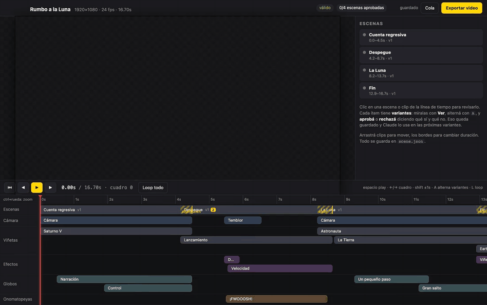
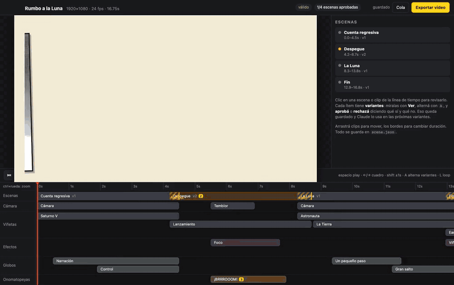

# comic-motion

**Motion comics con HTML, CSS y [Motion](https://motion.dev) (ex Framer Motion), como skill para [Claude Code](https://docs.claude.com/claude-code).**

Le pasás imágenes y videos a Claude, arma una animación tipo cómic (viñetas, cámara, globos de diálogo, onomatopeyas, líneas de velocidad, halftone) y te abre un **panel de revisión con línea de tiempo**. Ahí aprobás o rechazás variantes, pedís cambios por prompt y ajustás transiciones y timing. Al final **exporta a video** (MP4 H.264 o ProRes, 1080p o 4K) o **a HTML** para publicarlo en la web, con el mismo player en vivo.



*El panel en uso: mirar variantes y alternarlas con `A`, rechazar con motivo, aprobar con nota, mover un clip en la línea de tiempo y pedir variantes nuevas por prompt. La espera de la generación está recortada.*

---

## Qué trae

- **Player determinístico.** La animación es una función pura del tiempo, así que lo que ves en el panel es *exactamente* lo que sale en el video, cuadro por cuadro.
- **Panel local (Comic Studio):**
  - Línea de tiempo con pistas de cámara, viñetas, efectos, globos y onomatopeyas.
  - Arrastrar y estirar clips con snap a cuadro.
  - Loop de un tramo.
  - Inspector con los parámetros de cada preset.
  - Recarga en vivo cuando el archivo cambia desde afuera.
- **Variantes y revisión:**
  - Cada escena y cada clip puede tener varias variantes.
  - **Aprobar** con una nota ("qué me gusta") o **rechazar** con un motivo ("qué no funciona").
  - **Retocar** una variante por prompt, o pedir N variantes nuevas.
  - Las variantes nuevas se generan solas en segundo plano con `claude -p` y respetan la memoria de revisión: conservan lo aprobado y evitan lo rechazado.
  - Escenas distintas se generan en paralelo (3 a la vez por defecto, configurable en la barra); dentro de una escena, los pedidos van en fila.
  - `A` alterna entre dos variantes para compararlas.
  - **Guiado** en cada variante, y **Dirección** para el proyecto entero: en vez de escribir el pedido, respondés preguntas con opciones recomendadas y al final se genera.
  - Aviso de aprobación **desactualizada** cuando algo cambió después de aprobar.
- **Presets incluidos:**
  - **Transiciones:** corte, fundido, barrido, zoom punch, deslizar, corte diagonal, iris, mancha de tinta y flash.
  - **Cámara:** recorrido por keyframes, sacudida, inclinación holandesa y dolly.
  - **Viñetas** de imagen o video con Ken Burns, recorte, borde, inclinación y profundidad 2.5D.
  - **Globos:** diálogo, pensamiento, grito y narración, con máquina de escribir.
  - **Onomatopeyas:** slam, pop, temblor y estiramiento.
  - **Efectos:** líneas de velocidad, líneas de foco, flash y viñeteado.
  - **VFX en GPU** (three.js, WebGPU con respaldo a WebGL2): nieve, niebla, chispas, estallido de impacto, onda de choque, distorsión por calor, destello de impacto estilo anime y glow. Las partículas van en capas (detrás, entre el fondo y el personaje 2.5D, o delante) y son función pura del tiempo, así que el export coincide cuadro por cuadro.
  - **Filtros:** halftone, contorno de tinta, colores planos, papel, aberración de color y CSS libre.
- **Efectos custom:** un archivo JS por efecto en el proyecto, con el mismo contrato que los incluidos.
- **Ingesta asistida:**
  - Proxies de video para buscar cuadros con precisión.
  - Hojas de contacto para que Claude "vea" los videos.
  - Detección de viñetas en páginas de cómic (OpenCV.js).
  - Recorte de personajes para parallax (BiRefNet_lite en JS, sin Python).
  - **Material por capas** exportado del PSD (PNG más `scene_layout.json`): cada capa es un plano 3D real, con roles y profundidad automáticos, dolly con parallax de verdad y VFX entre capas. Con la cámara quieta coincide píxel a píxel con el PSD.
- **Export** cuadro por cuadro con Chromium headless (con GPU) y ffmpeg, o **a HTML**: el mismo player reproduciéndose en vivo en el navegador (carpeta para hosting estático o un solo `.html`).

## Requisitos

- [Claude Code](https://docs.claude.com/claude-code)
- Node.js 20 o más nuevo
- ffmpeg (con ffprobe)
- Unos 600 MB de disco (Chromium de Playwright, OpenCV.js y ONNX Runtime). El modelo de recorte (~200 MB) se descarga recién la primera vez que lo usás.

## Instalación

### Windows

1. Descargá o cloná este repo.
2. Hacé doble clic en **`install.bat`**.

El instalador:
- instala con `winget` lo que falte: Node.js LTS, ffmpeg y Git;
- ofrece instalar Claude Code si no lo encuentra;
- copia la skill a `%USERPROFILE%\.claude\skills\comic-motion`;
- instala las dependencias, compila el panel y descarga Chromium.

### macOS / Linux

```bash
git clone https://github.com/chafamaster2000/comic-motion.git
cd comic-motion
./install.sh
```

### Manual

```bash
git clone https://github.com/chafamaster2000/comic-motion.git ~/.claude/skills/comic-motion
cd ~/.claude/skills/comic-motion
npm install && npm run build && npx playwright install chromium
```

## Uso

Abrí Claude Code en una carpeta de trabajo y pedí algo como:

> Hagamos un motion comic con estas imágenes y este video: `./material/`

Primero te pregunta si querés hacerlo **guiado**: mira tu material y te entrevista de a una pregunta (destino, tono, qué hacer con los textos, cámara, 2.5D, VFX, look, final), cada una con su recomendación. Las respuestas quedan como la **dirección** del proyecto y todas las variantes que se generen después la respetan. Si preferís, vas directo.

Después Claude va a:
1. crear el proyecto;
2. mirar el material;
3. proponerte un storyboard;
4. armar la escena y revisar cuadros;
5. levantar el panel (por defecto en `http://127.0.0.1:4777`).

Desde el panel revisás, pedís variantes y exportás. En cualquier momento podés volver al chat ("seguimos con el comic") y Claude retoma desde lo que aprobaste y rechazaste.

### Atajos del panel

| Tecla | Acción |
|---|---|
| `Espacio` | Play / pausa |
| `←` / `→` | Cuadro anterior / siguiente (`Shift`: ±1 s) |
| `A` | Alternar entre la variante actual y la anterior |
| `L` | Loop del tramo marcado (`Shift` + arrastrar en la regla) |
| `Ctrl/⌘` + rueda | Zoom de la línea de tiempo |
| `P` | Elegir en el preview el punto de anclaje del VFX seleccionado (`Esc` cancela) |
| `+` / doble clic en un carril | Crear un clip en esa pista |
| Doble clic en el loop | Quitar el loop marcado |
| `Inicio` / `Fin` | Ir al principio (del loop, si está activo) / al final |
| `Esc` | Deseleccionar; en un diálogo, cerrarlo (el guiado sigue abierto en la barra) |
| `Ctrl/⌘` + `Enter` | Enviar el pedido escrito en el inspector |
| `1`–`4` (en el guiado) | Elegir esa opción de la pregunta |
| **Borrador** (botón de la barra) | Preview más liviano; el export sale siempre en calidad final |
| **⚠ N avisos** (barra) | Avisos del player (cámara, límites); la lista lleva al clip |

Con `comic studio --lan` el panel se puede abrir desde otro equipo de la red (`http://IP:puerto`). Por ser http fuera de localhost, el navegador no habilita WebGPU: el preview usa WebGL2 y el panel lo avisa (chip **VFX: WebGL2 (red)**). El export corre en la máquina del studio y usa WebGPU igual.

### CLI

La skill la usa por detrás, pero también la podés correr vos:

```
node ~/.claude/skills/comic-motion/bin/comic.js <comando>

  init <dir> [--title T] [--width 1920 --height 1080 --fps 24]
  ingest <dir> <archivos...>          copia imágenes/videos, proxy y hoja de contacto
  layers <dir> <scene_layout.json>    viñetas por capas de un PSD (crea el proyecto si no existe: --title, --fps)
  panels <dir> <assetId>              detecta viñetas en una página de cómic
  cutout <dir> <assetId>              recorta el personaje (profundidad 2.5D)
  check <dir>                         valida scene.json
  status <dir>                        resumen de revisión y pedidos
  presets                             catálogo de presets y parámetros
  snapshot <dir> --t 0.5,2,3.4        cuadros PNG sueltos
  studio <dir> [--port 4777] [--open] panel de revisión
  render <dir> [--quality 1080|4k] [--codec h264|prores] [--fps 24|30|60] [--from s --to s] [--workers auto|1-8]
  html <dir> [--out exports/<titulo>_web/] [--single] [--quality 4k|1080] [--no-controls] [--autoplay] [--loop] [--serve [--port N] [--open]]
```

## Un proyecto por dentro

```
mi-comic/
  scene.json        ← única fuente de verdad (escenas, clips, variantes, revisión)
  history.jsonl     ← registro de aprobaciones, rechazos, pedidos y exports
  assets/           ← tu material (+ proxies .webm y recortes)
  effects/          ← efectos custom (opcional)
  exports/          ← videos exportados
  .comic/           ← caché interna (hojas de contacto, snapshots, cola de pedidos)
```

El formato completo está en [`references/scene-format.md`](references/scene-format.md).

## Efectos custom

Creá `effects/miEfecto.js` en el proyecto:

```js
export default {
  id: 'miEfecto',
  kind: 'fx', // camera | panel | fx | bubble | ono | transition | filter
  label: 'Mi efecto',
  params: [{ key: 'color', label: 'Color', type: 'color', default: '#ffffff' }],
  build(ctx) {
    const el = document.createElement('div');
    ctx.mount(el, 'screen');
    return {
      update(t) {
        // solo función de t (y de ctx.rand / ctx.hashRand, que tienen semilla)
        el.style.background = ctx.params.color;
        el.style.opacity = Math.max(0, 1 - t / ctx.duration);
      },
    };
  },
};
```

Aparece solo en el panel. La única regla: todo tiene que depender del tiempo `t`. Nada de `Math.random()`, `Date.now()` ni animaciones CSS, porque si no el export no coincide con el preview.

## Exportar

Desde el botón **Exportar** del panel (o `comic render`) elegís resolución (1080p o 4K), formato (MP4 H.264 o ProRes), y tramo (todo o el loop marcado). Los **cuadros por segundo** (24, 30 o 60) son configuración del proyecto: se eligen en la barra superior del panel y tanto el preview como el export los respetan. El render corre cuadro por cuadro con el mismo player que el preview, así que lo que aprobaste es exactamente lo que sale.



*Export a 1080p: diálogo, progreso (acelerado) y unos segundos del video resultante.*

### Exportar a HTML (web)

En el diálogo, formato **HTML (web)**, o `comic html <dir>`. Sale el **mismo player** que el preview, reproduciéndose en vivo en el navegador: VFX en GPU (three WebGPU, con respaldo WebGL2), viñetas por capas 3D, filtros, globos, transiciones y video. Se exporta lo activo, como en el video.

```
comic html <dir> [--out exports/<titulo>_web/] [--single] [--quality 4k|1080] [--no-controls] [--autoplay] [--loop] [--serve [--port N] [--open]]
```

**Carpeta** (por defecto, `exports/<titulo>_web/`), autocontenida, para subir tal cual a un hosting estático (GitHub Pages, Netlify, un bucket):

| archivo | qué es |
|---|---|
| `index.html` | la página; lleva adentro la escena y la configuración (no hace falta `fetch` para eso) |
| `player.js` | el player (`dist/web.js`): script clásico (IIFE), no módulo ES |
| `effects.js` | los efectos custom usados, empaquetados (solo si hay) |
| `scene.json` | copia legible de la escena que va en `index.html` |
| `assets/` | solo los archivos de las variantes activas: imágenes, capas PNG y máscaras, proxies webm de los videos (el original no viaja), `cutout`/`bgfill` si la viñeta usa profundidad |
| `fonts/` | las tipografías usadas, con su licencia OFL |

La escena va **saneada**: solo la variante activa de cada escena y clip (los clips ocultos no viajan), sin memoria de revisión (estados, notas, rechazos, pedidos, `approvedHash`), sin `direction` ni la configuración del generador, sin `source`/`description`/hojas de contacto de los assets, y sin las huellas de archivos de la medición de límites (los datos de píxeles que usa la cámara `move3d` se quedan). Si queda alguna ruta absoluta, el export lo avisa. Al terminar imprime el tamaño total.

**`--single`**: un solo `.html` (`exports/<titulo>.html`) con todo embebido en base64, para abrir con doble clic o mandar por mail. Tope: 50 MB de archivos (≈ 67 MB el `.html`); si se pasa, error y sugerencia de usar la carpeta.

**El player web:** escala el cuadro al tamaño de la ventana manteniendo la proporción (letterbox) con `zoom` CSS, igual que el exportador, y dibuja los canvas GPU a la resolución del dispositivo (`devicePixelRatio`). `--quality` es el **tope** de esos canvas: `4k` (por defecto, 3840 px de ancho) o `1080` (1920 px: más liviano en notebooks y celulares). Antes de arrancar precarga todos los archivos con una barra de progreso (los descarga a `blob:` URLs, así las texturas GPU no tienen problemas de origen). Reproduce en tiempo real a `meta.fps`, cuantizado a cuadros como el preview. Controles mínimos (se apagan con `--no-controls`): play/pausa, barra de tiempo, loop y pantalla completa; teclas `Espacio` (o clic en el cuadro), `←`/`→` un cuadro (`Shift` ±1 s), `F` pantalla completa, `L` loop. `--autoplay` arranca solo (no hay audio, así que el navegador lo permite); `--loop` repite. `?ui=0` en la URL esconde controles y carteles (capturas, iframes limpios). Para tests y automatización expone `window.__comicWeb` (`seek(t)`, `play()`, `pause()`, `time`, `duration`, `gpuBackend`, `loadMs`).

**`file://` vs servidor.** Chrome, abriendo un archivo desde el disco, deja usar WebGPU (cuenta como contexto seguro) y scripts clásicos, pero **no** deja leer archivos con `fetch`, y una imagen o video de otro archivo local "contamina" la textura (la GPU no puede leer sus píxeles). Por eso:

| | http (hosting, `--serve`) | `file://` (doble clic) |
|---|---|---|
| carpeta | anda todo | lo DOM se vería, pero si hay viñetas GPU (VFX, capas) muestra un aviso: abrir con un servidor o exportar `--single` |
| `--single` | anda todo | anda todo (los archivos embebidos se pasan a `blob:` URLs del propio documento) |

`comic html <dir> --serve` exporta y sirve la carpeta por http (`--port`, `--open`); `comic html <carpetaExportada> --serve` sirve una que ya existe. Cualquier server estático sirve igual (`npx serve`, `python3 -m http.server`).

Desde el panel, el diálogo muestra el enlace a la carpeta o al archivo (servido por el studio en `/p/exports/…`) y un botón **Abrir**. `node test/html-export.mjs` exporta un proyecto de prueba (imagen, VFX, globo, onomatopeya, efecto custom, transición, video), lo abre por http y por `file://` y compara cada cuadro contra `comic snapshot` del mismo `t`.

### Rendimiento

Medido con GPU en Apple Silicon: 1080p ≈ 2 a 3 veces el tiempo real y 4K ≈ 7 veces. Los filtros SVG (tinta, colores planos) son lo más caro. Sin GPU pueden ser bastante más lentos.

**Export en paralelo.** El tramo se parte en N tramos contiguos de cuadros (**En paralelo** en el diálogo, `--workers` en la CLI; *Auto* = el mínimo entre la mitad de los núcleos, hasta 4; lo que entra en memoria, ~1,5 GB por navegador a 1080 y ~2,5 GB a 4K contra `max(os.freemem(), os.totalmem()/2)` (en macOS `freemem` no cuenta la caché que se libera sola); y uno cada 30 cuadros. Siempre al menos 1, y el botón muestra cuántos usaría: 24 GB → 4 a 1080 y a 4K, 16 GB → 4 y 3, 8 GB → 2 y 1). Cada tramo lo renderiza su propio Chromium con su propio ffmpeg, con el mismo códec y los mismos parámetros, y al final se unen con el concat de ffmpeg **sin recodificar** (`-c copy`). Como el render es función pura de `t` y cada cuadro usa el mismo `t = desde + i/fps` que en serie, los cuadros son los mismos: en ProRes el resultado es idéntico bit a bit al de 1 navegador (`node test/export-parity.mjs` lo comprueba). En H.264 cada tramo arranca en un keyframe, así que el bitstream cambia en las uniones pero la calidad es la misma (CRF 16) y los cuadros son los mismos; el archivo final se verifica con `ffprobe -count_frames`. Cancelar o un error en cualquier tramo corta todos y borra los temporales.

Medido en una Mac mini M4 (10 núcleos), proyecto por capas con VFX, 31,2 s a 1080p60 (1872 cuadros), H.264:

| | tiempo | ms/cuadro |
|---|---|---|
| antes (1 navegador, 2 rAF por cuadro) | 215 s | 115 |
| 1 navegador | 183 s | 98 |
| 2 en paralelo | 141 s | 75 |
| 3 en paralelo | 102 s | 54 |
| 4 en paralelo (Auto) | 92 s | 49 |
| 6 en paralelo | 99 s | 53 |

4K (3 s, 180 cuadros): 89 s antes, 44 s con 4 en paralelo. Un navegador por tramo rinde bastante más que varias pestañas o contextos del mismo navegador (49 contra 75 ms/cuadro con 4): la captura PNG se serializa dentro de cada navegador.

Otras cosas que se midieron: la espera por cuadro bajó de 2 `requestAnimationFrame` a 1 (la captura ya fuerza un cuadro nuevo; comparado bit a bit en 348 cuadros seguidos con transiciones, VFX, capas y video: idénticos). La captura sigue en PNG con `optimizeForSpeed` (≈ 110 ms por cuadro a 1080p en serie): PNG normal tarda 1 s, WebP calidad 100 (sin pérdida) 0,9 s, JPEG y screencast pierden calidad, y `HeadlessExperimental.beginFrame` no existe en macOS.

## Limitaciones conocidas

- Sin audio: el export sale mudo (también el HTML).
- El export HTML en carpeta necesita un servidor (o hosting) cuando hay VFX o capas; para doble clic, `--single`. El HTML se probó en Chrome/Chromium; en navegadores sin WebGPU three cae a WebGL2.
- La detección de viñetas asume canaletas de un color parejo. Si las viñetas se tocan, Claude corrige los recortes mirando el overlay.
- En la profundidad 2.5D, el hueco que dejan los personajes se rellena en JS, sin IA: se extiende el color del entorno sin que la tinta ni el negro de los bordes de viñeta se difundan, y se le trasplanta textura (nieve, grano) desde zonas cercanas. No reconstruye objetos ni líneas que el personaje tapaba: en movimientos muy grandes se nota una zona más lisa, y los huecos chicos entre brazos o piernas pueden verse como parches. El recorte suma el contorno de tinta que el segmentador deja afuera y descarta motas sueltas, así el personaje se lleva su contorno. Los textos dibujados en la imagen se fijan con `depthLock` para que no se desfasen.
- Probado en macOS. Windows y Linux están soportados por el instalador, pero tienen menos horas de uso.

## Licencias

- Código: [MIT](LICENSE).
- Tipografías incluidas: [Bangers](fonts/OFL-Bangers.txt) y [Comic Neue](fonts/OFL-ComicNeue.txt), ambas SIL Open Font License 1.1.
- Modelo de recorte: [BiRefNet_lite](https://huggingface.co/onnx-community/BiRefNet_lite-ONNX) (MIT). Se descarga en el primer uso, no viene incluido.
- Dependencias principales: Motion, React, Playwright, sharp, OpenCV.js y transformers.js, cada una con su licencia.
- Material del demo de los GIFs: fotos y video de la NASA (Apolo 8, Apolo 11 y Artemis I), de dominio público. Su uso no implica respaldo de la NASA a este proyecto.
